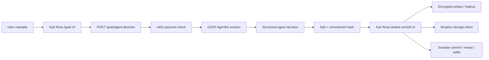

# GOAT Integration

Sub Rosa includes a GOAT AgentKit integration for x402-paid agent decisions that
can feed the sealed commitment path. This is not a logo-only integration: the
repo installs `@goatnetwork/agentkit`, registers a GOAT action provider, and
adds an x402-gated API endpoint for structured agent output.

In the overall architecture, GOAT sits above the sealed-round primitive. It can
prepare a decision, bid amount, and commitment payload; Sub Rosa still handles
tlock sealing, Walrus/Bosphor artifacts, Soroban commits, Drand reveal, and
settlement.

## What GOAT does here

GOAT AgentKit is the agent runtime boundary. Sub Rosa uses it to create an
agent session and expose GOAT/x402 tool registration while Sub Rosa keeps the
sealed-round mechanics:

- GOAT AgentKit: agent runtime, tool registration, payment-oriented agent
  actions, and future live GOAT tool execution.
- x402: payment gate before premium agent output is returned.
- Sub Rosa/tlock: commitment payload generation compatible with sealed bid
  preimages.
- Walrus/Bosphor: encrypted artifact route for heavy private material and
  optional agent evidence.
- Stellar/Soroban: canonical sealed round, reveal, clear, and settle flow.

Without live GOAT credentials, the endpoint uses local deterministic decisioning
and marks every response as `goat.mode = "local_deterministic"`. That behavior
exists so validation, UI wiring, and x402 boundaries can be reviewed locally. It
is not described as live GOAT inference.

## Architecture



## API

`GET /goat/status`

Returns GOAT integration status and the x402 requirement. It discloses whether
live credentials are present and whether live GOAT mode is enabled.

`POST /goat/agent-decision`

Protected by the same `x402HTTPResourceServer` flow as `POST /appraise`.
Without a valid `X-PAYMENT` header the server returns HTTP 402. With a valid
payment, it validates the body and returns:

```json
{
  "decision": {
    "roundId": "string",
    "agentId": "string",
    "decisionType": "sealed_bid",
    "recommendedAction": "participate",
    "bidAmount": "86.00",
    "confidence": 0.72,
    "reasoningSummary": "string",
    "riskNotes": ["string"],
    "commitmentPayload": {
      "salt": "hex-32-bytes",
      "commitmentHash": "hex-sha256",
      "encryptedArtifactUri": null
    },
    "goat": {
      "mode": "local_deterministic",
      "agentkit": {
        "package": "@goatnetwork/agentkit",
        "available": true,
        "tools": ["payment.create"]
      },
      "requiresCredentials": true
    }
  }
}
```

## Environment

The x402 server still needs the existing appraisal API secrets:

```bash
FACILITATOR_SECRET=S...
PAY_TO=G...
PAYMENT_ASSET=C...
PRICE=0.10
X402_NETWORK=stellar:testnet
```

GOAT-specific settings:

```bash
GOAT_AGENTKIT_API_KEY=
GOAT_API_KEY=
GOAT_LIVE_ENABLED=false
GOAT_NETWORK=goat-testnet
GOAT_AGENT_MODEL=goat-agentkit-runtime
GOAT_X402_ENABLED=true
GOAT_X402_RECEIVER_ADDRESS=
GOAT_X402_NETWORK=stellar:testnet
GOAT_X402_PRICE_USDC=0.10
```

Frontend:

```bash
VITE_GOAT_AGENT_API_URL=http://127.0.0.1:4021
```

## Live vs local

Implemented live today:

- Real `@goatnetwork/agentkit` dependency.
- GOAT AgentKit session construction and action registration.
- Real x402 HTTP 402 challenge path for `POST /goat/agent-decision`.
- Structured Zod validation for request and response.
- Commitment payload generation using Sub Rosa's existing commitment encoding.
- UI handoff into the sealed commitment flow.

Requires external access:

- GOAT credentials or API/faucet access for live GOAT tool execution.
- Funded Stellar testnet accounts with USDC trustlines for paid x402 calls.
- Walrus/Bosphor env vars for storing encrypted artifacts in the storage route.
